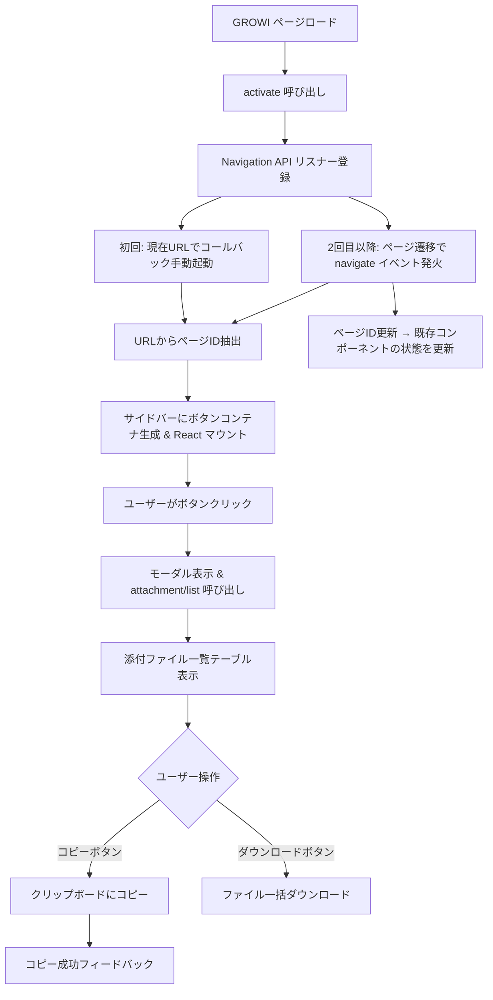
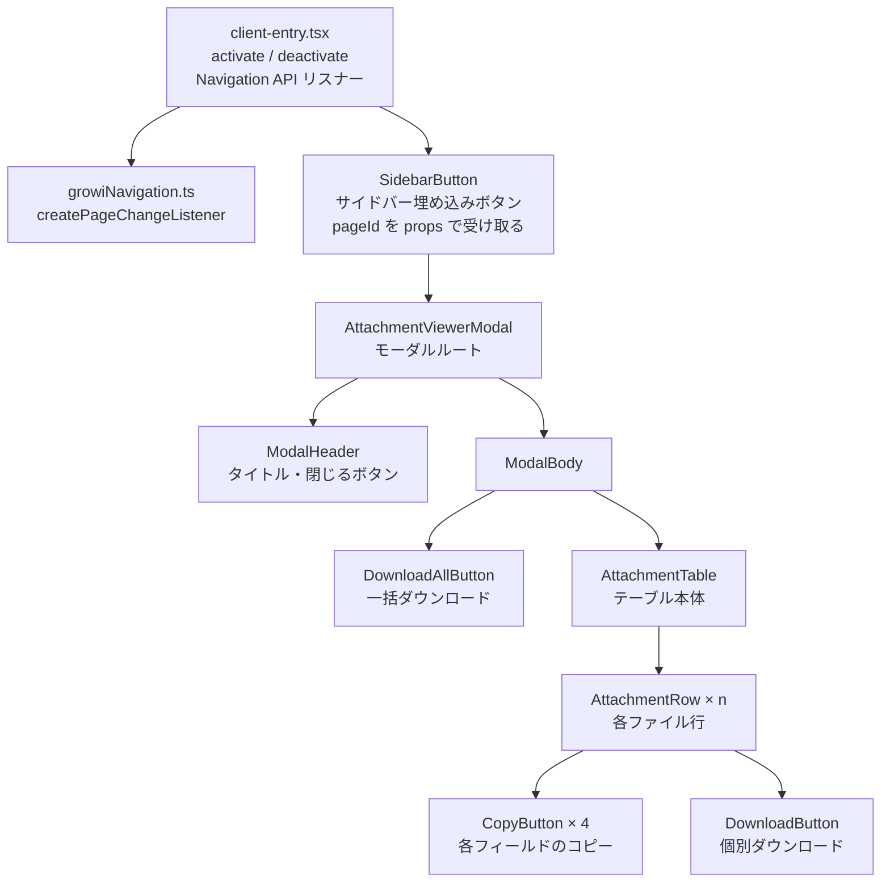
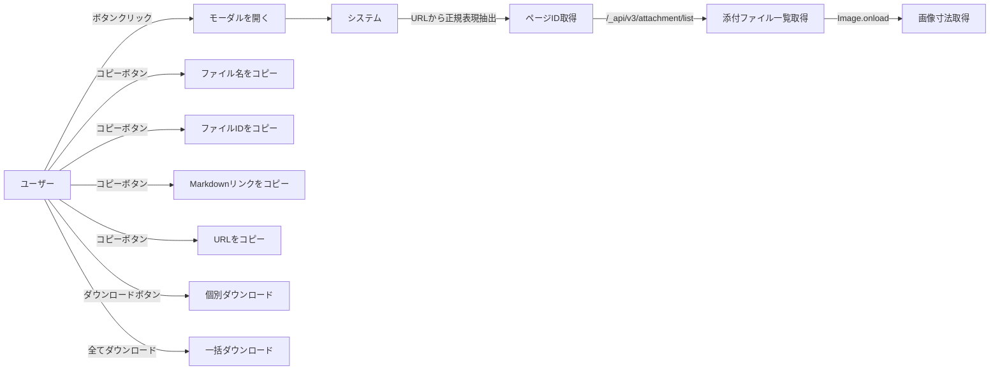
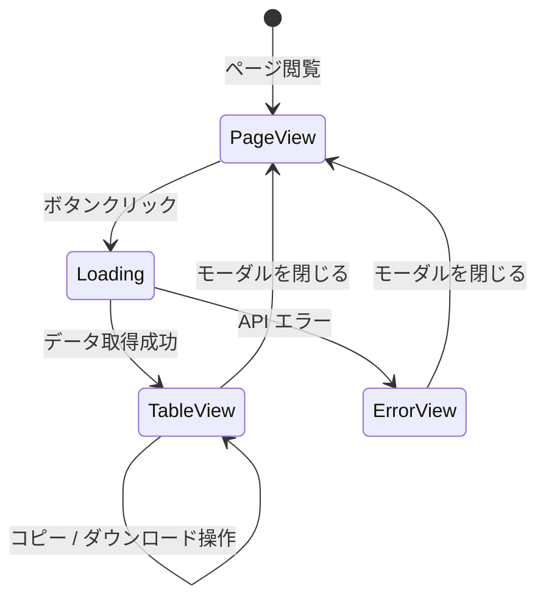

# 機能設計書

## アーキテクチャ概要

### プラグイン種別

GROWI の `script` 型プラグインとして実装する。
プラグインは `activate()` / `deactivate()` を `window.pluginActivators` に登録し、
GROWI が各ページロード時に呼び出す。

### ページ遷移検知方式

MutationObserver は使用せず、**ブラウザネイティブの Navigation API**（`window.navigation`）を使用する。

- `window.navigation.addEventListener('navigate', handler)` でSPAのページ遷移を検知
- 初回ロード時は `navigate` イベントが発火しないため、`activate()` 内で現在URLを元に手動起動
- ページID は GROWI の URL 形式（`/{24桁16進数のMongoDBオブジェクトID}`）から正規表現で直接抽出
  - 正規表現: `/^\/([0-9a-f]{24})$/i`
  - API呼び出し不要

### システム構成図



### コンポーネント構成図



---

## データモデル定義

### GROWI API レスポンス（`/_api/v3/attachment/list`）

```typescript
type Attachment = {
  _id: string;              // MongoDB ObjectId（ファイルID）
  originalName: string;     // 元のファイル名
  fileName: string;         // 内部ハッシュファイル名
  fileFormat: string;       // MIMEタイプ（例: "image/jpeg"）
  fileSize: number;         // ファイル容量（バイト）
  page: string;             // ページの ObjectId
  creator: string;          // アップロードユーザーの ObjectId
  createdAt: string;        // ISO 8601 形式の日時
  filePathProxied: string;  // 閲覧URL（例: "/attachment/{id}"）
  downloadPathProxied: string; // ダウンロードURL（例: "/download/{id}"）
};

type AttachmentListResponse = {
  paginateResult: {
    docs: Attachment[];
    totalDocs: number;
    limit: number;
    page: number;
    totalPages: number;
    hasNextPage: boolean;
    hasPrevPage: boolean;
  };
};
```

### プラグイン内部の加工済みデータ型

```typescript
type AttachmentViewModel = {
  id: string;               // _id
  originalName: string;     // 元ファイル名
  baseName: string;         // 拡張子なしのファイル名
  extension: string;        // 拡張子（ドットなし）
  fileFormat: string;       // MIMEタイプ
  isImage: boolean;         // 画像ファイルかどうか
  fileSizeBytes: number;    // バイト単位容量
  fileSizeLabel: string;    // 表示用容量（例: "2.0 MB"）
  imageDimensions: {        // 画像の場合のみ
    width: number;
    height: number;
  } | null;
  viewUrl: string;          // 閲覧URL（絶対URL）
  downloadUrl: string;      // ダウンロードURL（絶対URL）
  markdownLink: string;     // Markdown形式リンク
  downloadFileName: string; // DL時のファイル名（{baseName}-{id}.{extension}）
};
```

---

## コンポーネント設計

### client-entry.tsx

**責務**: プラグインエントリポイント。`activate` / `deactivate` の実装と Navigation API リスナーの管理。

**処理フロー**:

1. `activate()` 呼び出し時、`createPageChangeListener` を使って Navigation API リスナーを起動
2. コールバック（`handlePageChange`）が初回呼び出される際に DOM が確実に準備済みのため、サイドバーにコンテナを生成して React コンポーネントを `createRoot` でマウント
3. 2回目以降のページ遷移では、既存コンポーネントに新しい `pageId` を渡して状態更新（アンマウント不要）
4. `deactivate()` 時に Navigation API リスナーを解除し、`root.unmount()` で React ツリーを破棄

```typescript
// client-entry.tsx の概略
const { start, stop } = createPageChangeListener(handlePageChange);
let root: Root | null = null;
let updatePageId: ((id: string) => void) | null = null;

async function handlePageChange(ctx: GrowiPageContext): Promise<void> {
  const pageId = ctx.pageId.replace('/', ''); // 先頭スラッシュを除去
  if (root == null) {
    // 初回：サイドバーへコンテナ挿入 & React マウント
    const container = document.createElement('div');
    container.id = 'growi-attachment-viewer-root';
    document.body.appendChild(container);
    root = createRoot(container);
    root.render(
      <SidebarButton
        initialPageId={pageId}
        onRegisterUpdater={(fn) => { updatePageId = fn; }}
      />
    );
  } else {
    // 2回目以降：ページIDを更新
    updatePageId?.(pageId);
  }
}
```

### growiNavigation.ts

参考リポジトリの実装をそのまま流用する。
`createPageChangeListener` は `start()` / `stop()` を返し、`window.navigation` API を利用する。

### SidebarButton

**Props**:
```typescript
type Props = {
  initialPageId: string;
  onRegisterUpdater: (fn: (id: string) => void) => void;
};
```

**責務**:
- `useState` で `pageId` を管理し、`onRegisterUpdater` 経由で外部（`client-entry.tsx`）から更新可能にする
- サイドバーへの埋め込みボタン。クリックで `AttachmentViewerModal` を開く

### AttachmentViewerModal

**Props**:
```typescript
type Props = {
  pageId: string;
  isOpen: boolean;
  onClose: () => void;
};
```

**責務**:
- モーダルのオーバーレイとコンテナのレンダリング
- `/_api/v3/attachment/list` への API 呼び出し（全ページ取得）
- ローディング・エラー状態の管理
- `pageId` が変化したとき（ページ遷移後にモーダルを開いた場合）に自動再取得

**状態**:
```typescript
const [attachments, setAttachments] = useState<AttachmentViewModel[]>([]);
const [isLoading, setIsLoading] = useState(true);
const [error, setError] = useState<string | null>(null);
```

### AttachmentTable

**Props**:
```typescript
type Props = {
  attachments: AttachmentViewModel[];
};
```

**責務**: テーブルヘッダーとボディのレンダリング。各行に `AttachmentRow` を展開する。

**テーブル列定義**:

| # | カラム名 | 内容 | コピー対象 |
|---|----------|------|-----------|
| 1 | ファイル名 | `originalName` | ファイル名テキスト |
| 2 | ファイルID | `id` | IDテキスト |
| 3 | サイズ | `fileSizeLabel` | - |
| 4 | 寸法 | `{width} × {height}` | - （画像のみ） |
| 5 | Markdown リンク | コピーボタン | `markdownLink` |
| 6 | URL | コピーボタン | `viewUrl` |
| 7 | DL | 個別ダウンロードボタン | - |

### AttachmentRow

**Props**:
```typescript
type Props = {
  attachment: AttachmentViewModel;
};
```

**責務**: 1ファイル分の行をレンダリング。各フィールドに `CopyButton` を配置。

### CopyButton

**Props**:
```typescript
type Props = {
  text: string;       // コピーするテキスト
  label?: string;     // ボタンラベル（デフォルト: "コピー"）
};
```

**責務**: `navigator.clipboard.writeText` でクリップボードコピー。成功時に一時的に「✓ コピー完了」表示に切り替え（2秒後に元に戻す）。

### DownloadAllButton

**Props**:
```typescript
type Props = {
  attachments: AttachmentViewModel[];
};
```

**責務**: 全ファイルの順次ダウンロード。`<a download>` タグを動的生成して発火する方式。

---

## 画面・UI設計

### サイドバーへのボタン挿入イメージ

```
┌──────────┬──────────────────────────────────────────────────────┐
│ サイドバー│ /your/page/name                                      │
│          │ ─────────────────────────────────────────────────────│
│ [📎 添付] │ ページ本文...                                        │
│  ↑ここに │                                                      │
│  挿入    │                                                      │
└──────────┴──────────────────────────────────────────────────────┘
```

### モーダルワイヤーフレーム

```
┌─────────────────────────────────────────────────────────┐
│  添付ファイル一覧（5件）                            [×] │
├─────────────────────────────────────────────────────────┤
│  [全てダウンロード]                                      │
├────────────┬──────────────┬───────┬────────┬────┬────┬──┤
│ ファイル名 │ ファイルID   │ サイズ│  寸法  │ MD │URL │DL│
├────────────┼──────────────┼───────┼────────┼────┼────┼──┤
│ image.png  │ abc123...    │ 1.2MB │640×480 │[📋]│[📋]│↓ │
│ [📋]       │ [📋]         │       │        │    │    │  │
├────────────┼──────────────┼───────┼────────┼────┼────┼──┤
│ doc.pdf    │ def456...    │ 320KB │   -    │[📋]│[📋]│↓ │
│ [📋]       │ [📋]         │       │        │    │    │  │
└────────────┴──────────────┴───────┴────────┴────┴────┴──┘
```

---

## API 連携設計

### ページID取得フロー

GROWI の閲覧 URL は `/{24桁16進数}` 形式（MongoDB ObjectId）のため、
API 呼び出しなしに URL から直接ページIDを抽出できる。

```
1. Navigation API の navigate イベント、または起動時の location.pathname を取得
   例: "/6995d3fcf17c96c558f6b0ab"

2. 正規表現 /^\/([0-9a-f]{24})$/i でマッチ
   → マッチした 24 文字がページID

3. ページIDを使って添付ファイル一覧を取得
   （API呼び出しは attachment/list のみ）

※ マッチしない URL（トップページ、設定画面等）ではボタンを非表示にする
```

### 添付ファイル一覧取得フロー

```
1. GET /_api/v3/attachment/list?pageId={pageId}&page=1
   → paginateResult.totalPages を確認

2. totalPages > 1 の場合、残りページを並列取得
   GET /_api/v3/attachment/list?pageId={pageId}&page=2
   GET /_api/v3/attachment/list?pageId={pageId}&page=3
   ...

3. 全ページの docs を結合して AttachmentViewModel に変換
```

### 画像寸法取得フロー

```
1. fileFormat が "image/*" であることを確認（isImage = true）

2. Image オブジェクトを生成して viewUrl を src にセット
   const img = new Image();
   img.src = attachment.viewUrl;

3. onload イベントで naturalWidth / naturalHeight を取得

4. imageDimensions に設定
```

### ダウンロードファイル名の変換ロジック

```typescript
// 元のファイル名: "my photo.png"
// ファイルID: "abc123def456"
// → ダウンロードファイル名: "my photo-abc123def456.png"

function buildDownloadFileName(originalName: string, id: string): string {
  const lastDot = originalName.lastIndexOf('.');
  if (lastDot === -1) {
    // 拡張子なし
    return `${originalName}-${id}`;
  }
  const baseName = originalName.substring(0, lastDot);
  const extension = originalName.substring(lastDot + 1);
  return `${baseName}-${id}.${extension}`;
}
```

### 一括ダウンロード実装方式

```typescript
// <a download> タグを動的生成して順次発火
async function downloadAll(attachments: AttachmentViewModel[]): Promise<void> {
  for (const attachment of attachments) {
    const a = document.createElement('a');
    a.href = attachment.downloadUrl;
    a.download = attachment.downloadFileName;
    document.body.appendChild(a);
    a.click();
    document.body.removeChild(a);
    // ブラウザのダウンロードマネージャーへの連続リクエストを避けるため待機
    await new Promise(resolve => setTimeout(resolve, 300));
  }
}
```

---

## ユースケース図



---

## 画面遷移図


